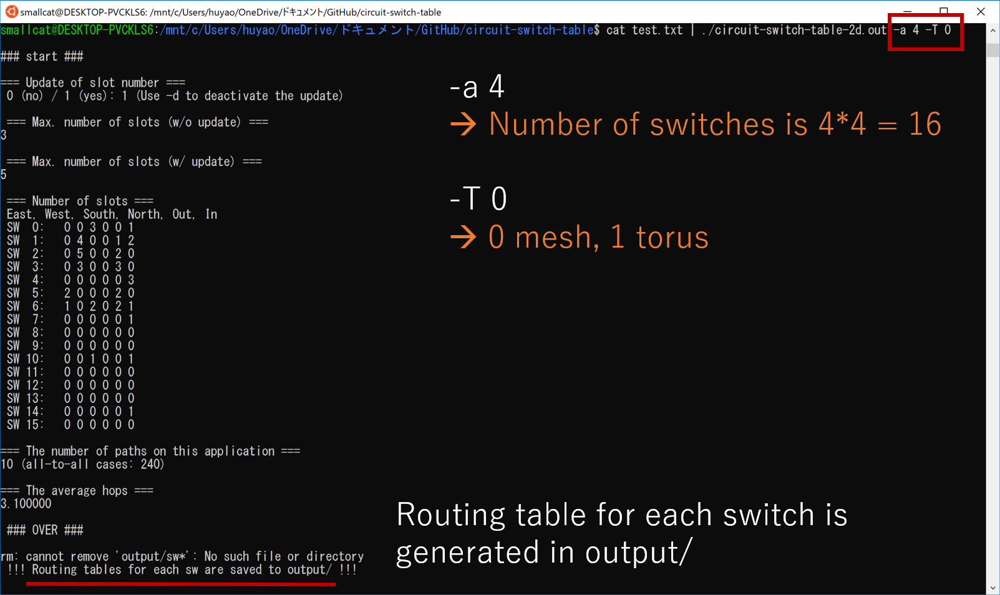
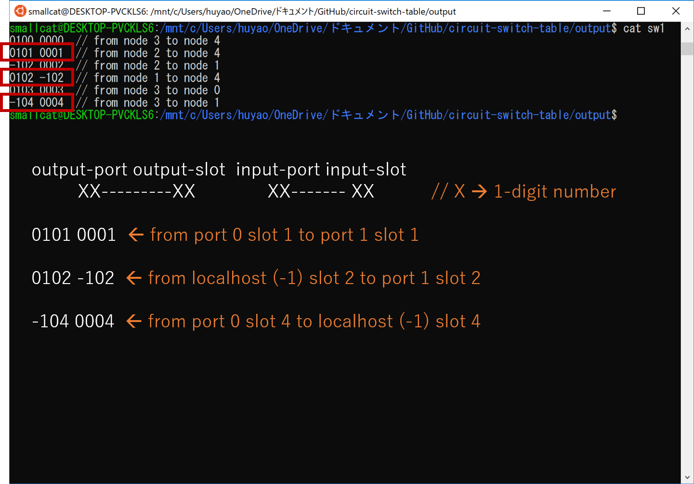
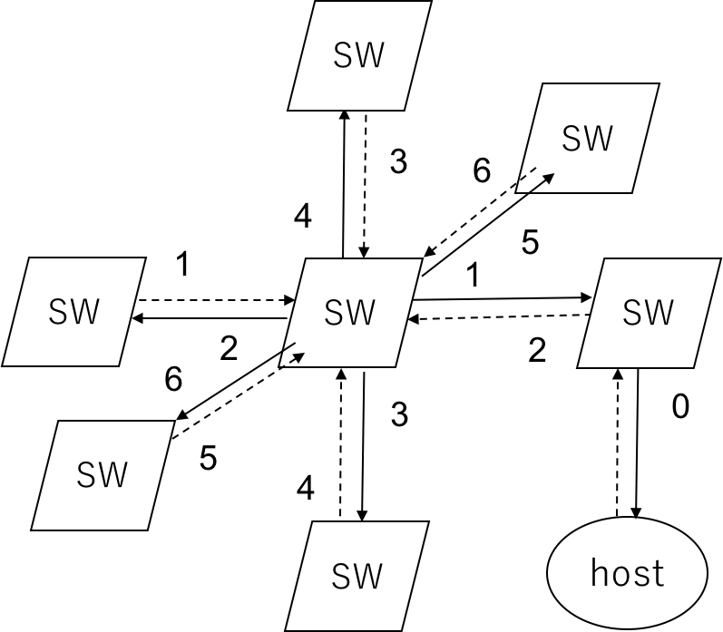
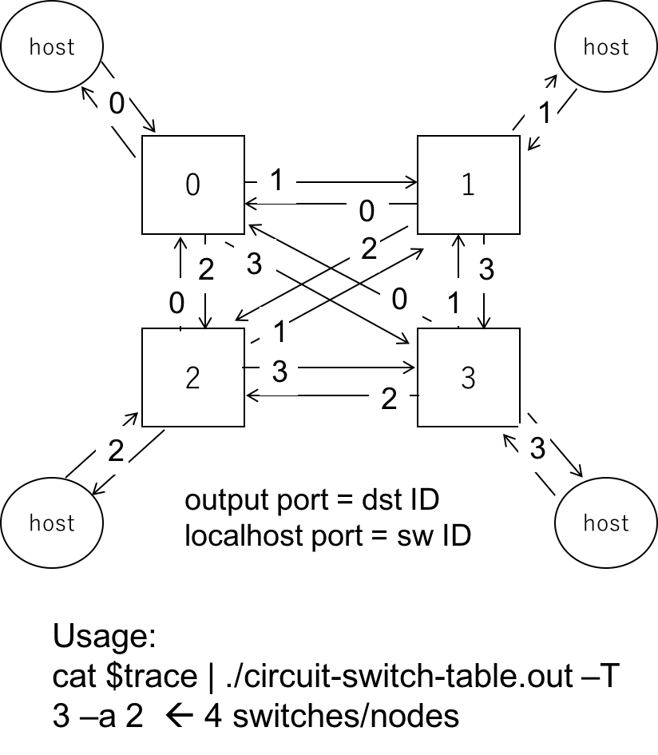
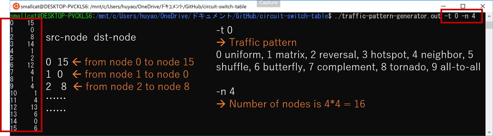

# circuit-switch-table
This repo contains the work on circuit-switched network, including estimating # of slots, generating routing table for each switch.

## Usages 
uniform, 16 nodes, 2-d mesh
```shell
$ ./tpg.out -t 0 -a 4 | ./cst.out -T 0 -a 4
```

uniform, 16 nodes, 2-d torus
```shell
$ ./tpg.out -t 0 -a 4 | ./cst.out -T 1 -a 4
```

uniform, 64 nodes, 3-d mesh
```shell
$ ./tpg.out -t 0 -a 4 -j 3 | ./cst.out -T 0 -a 4 -D 3
```

uniform, 64 nodes, 3-d torus
```shell
$ ./tpg.out -t 0 -a 4 -j 3 | ./cst.out -T 1 -a 4 -D 3
```

uniform, 16 nodes, 1s-4s-16n fat-tree
```shell
$ ./tpg.out -t 0 -a 4 | ./cst.out -T 2 -a 4 -n 4
```

uniform, 64 nodes, 1s-4s-16s-64n fat-tree
```shell
$ ./tpg.out -t 0 -a 8 | ./cst.out -T 2 -a 8 -n 4
```

uniform, 16 nodes, fully-connected
```shell
$ ./tpg.out -t 0 -a 4 | ./cst.out -T 3 -a 4
```

uniform, 8 ports (2 intra-group, 6 inter-group), 4 switches in a group, (6*4+1)*4 = 100 nodes, fcc
```shell
$ ./tpg.out -t 0 -a 10 | ./cst.out -T 4 -d 8 -m 4
```

topology file (w/ flow id)
```shell
$ cat test-tf.txt | ./cst.out -T 5 -t topo-file-cross.txt
```

## Parameters:
| Parameter | Note | Value |
| --- | --- | --- |
| **-T \<n\>** | Set topology | 0: Mesh, <br> 1: Torus, <br> 2: Fat Tree, <br> 3: Fully Connected, <br> 4: Dragonfly (FCC), <br> 5: Topology File |
| **-a \<n\>** | Set array size for mesh (-T 0) or torus (-T 1) | Integer <br> (defaultly 4) |
| **-n \<n\>** | Set the number of hosts to one switch for fat-tree (-T 2) | Integer <br> (defaultly 1) |
| **-u** | Allow to update a slot number (at intermediate switches on a path) |  |
| **-D \<n\>** | Set switch degree for mesh (-T 0) or torus (-T 1) | Integer <br> (defaultly 4) |
| **-d \<n\>** | Set switch ports (not include host) for dragonfly (-T 4) | Integer <br> (defaultly 8) |
| **-m \<n\>** | Set the number of switches in a group for dragonfly (-T 4) | Integer <br> (defaultly 4) |
| **-t \<filename\>** | Set topology file name (-T 5) | File name |
| **-s \<n\>** | Set the total number of slots in a switch | Integer <br> (defaultly 8) |
| **-r** | Set flow ID in accordance with slot # (flow ID= slot #) |  |

## 2019/09/09 update
### Adds
* Support setting flow ID in accordance with slot # (flow ID= slot #)
### Parameters
* -r 

## 2019/09/04 update
### Adds
* Support setting the total number of slots in a switch
### Parameters
* -s (defaultly 8)

## 2019/02/01 update
### Adds
**Support flow id specified in input traffic file**

    #Src Dst Flow_ID

    0 2 0
    0 1 1
    2 0 2
    2 1 2
    2 3 2
    3 1 3

* Flow id should be specified continuously from 0, 1, 2, ...
* Allocated slot number is not updated for each node pair with the same flow id
* Compatible with previous versions (old input traffic files)
## 2019/01/28 update
### Adds
* Support the customized topology file with the specified switch number and port number
* For each line in the topology file, the format is 
```
Src_SW Src_Port Dst_SW Dst_Port
```
### Parameters
* -T 5 (customized topology file, must be followed by -t to specify the topology file name)
* -t [topo-file-name]  
### Example of topology file
SW0 (port2) <--> (port2) SW1 (port1) <--> (port1) SW2

    0 2 1 2
    1 1 2 1

* port0 is retained for localhost
### Usage
```
$ cat test-tf.txt | ./cst.out -T 5 -t topo-file-cross.txt
```
## 2018/11/24 update
### Adds
* Support the topology of Full mesh Connected Circles (FCC)
* In FCC, switches in a group are connected by a ring (a mesh if it has 4 switches)
### Parameters
* -T 4 (FCC)
* -d (defaultly 8, which is divided into 6 inter-group connections and 2 intra-group connections)
* -m (number of switches in a group, defaultly 4)
### Switch-switch
* switch offset 0,1,2,3 in group A is connected to switch offset 3,2,1,0 in group B respectively
### Port
* When d = 8, host: 0, intra-group backward: 1, intra-group forward: 2, inter-group: 3-8
* Port 3-8 of a switch (0,1,2,3) in group A is connected to port 8-3 of a switch (3,2,1,0) in group B
### Usage
* FCC topology, uniform traffic pattern, d = 8, m = 4, switches are ((d-2)*m+1)*m = 100
```
$ ./tpg.out -t 0 -a 10 | ./cst.out -T 4 -d 8 -m 4
```
## Source Files
### Makefile
This file produces two executable files:
* tpg.out

    traffic pattern generator (see details in traffic-pattern-generator.cc)

* cst.out

    circuit switch table (see details in circuit-switch-table.cc)

Usage: 
```
$ ./tpg.out -t $traffic_pattern -a $node_num | ./cst.out -T $topology -a $node_num
```
Other parameters:
* mesh (-T 0)

    -D [1-4]  --> dimension

* torus (-T 1)

    -D [1-4]  --> dimension

* fat-tree (-T 2)
    
    -n $host_num  --> number of hosts for each switch

* fully-connected (-T 3)

    no others
    
### circuit-switch-table.cc
* This file estimates # of slots and generates routing table for each switch.
* It supports 
    
     mesh (-T 0 -D [1-4])
     
     torus (-T 1 -D [1-4])
     
     fat-tree (-T 2)
     
     fully-connected (-T 3) 

   as the host interconnection network (-a).
* It defaultly does NOT support the update of slot # during slot ID allocation (add -u to activate the update).
* The generated routing tables for corresponding switches are saved in output/, which is refreshed (NOT appended!) after each execution.
* Switch Number (2-D): as follows.

<div align=center>
  
</div>

* Switch Port Number (2-D): Localhost 0, East 1, West 2, South 3, North 4.

<div align=center>

</div>

* Compilation:
```
$ g++ -c circuit-switch-table.cc  
$ g++ circuit-switch-table.o -o circuit-switch-table.out
```
* Usage: 
```
// for test in a 16-switch 2-D mesh (see traffic pattern details in test.txt)  
$ cat test.txt | ./circuit-switch-table.out -a 4 -T 0 -D 2
```

<div align=center>

</div>

* Routing table generated in output/ (file name starting with sw):

<div align=center>

</div>

```
// 64-switch 2-D torus (see traffic pattern details in traffic-pattern-generator.cc below) 
$ cat ./traffic-pattern-generator.out -t 0 | ./circuit-switch-table.out -a 8 -T 1 -D 2
```

* Switch Number (3-D): as follows.

<div align=center>

</div>

* Switch Port Number (3-D): Localhost 0, East 1, West 2, South 3, North 4, back 5, front 6.

<div align=center>

</div>

* Switch Port Number (fat-tree): 

<div align=center>

</div>

* Switch Port Number (fully-connected): 

<div align=center>

</div>

### test.txt
* This test file shows a simple src-dst traffic for 16-node 2-D mesh.
### traffic-pattern-generator.cc
* This file helps to generate various traditional traffic patterns, including (-t) 0 uniform, 1 matrix, 2 reversal, 3 hotspot, 4 neighbor, 5 shuffle, 6 butterfly, 7 complement, 8 tornado, 9 all-to-all.
* Compilation:
```
$ g++ -c traffic-pattern-generator.cc  
$ g++ traffic-pattern-generator.o -o traffic-pattern-generator.out
```
* Usage:
```
// 16-node uniform (-t 0 uniform, 1 matrix, 2 reversal, 3 hotspot, 4 neighbor, 5 shuffle, 6 butterfly, 7 complement, 8 tornado, 9 all-to-all)  
$ ./traffic-pattern-generator.out -t 0 -n 4
```  
<div align=center>

</div>

### traffic-pattern-generator.h
* This file is the head file for traffic-pattern-generator.cc.
